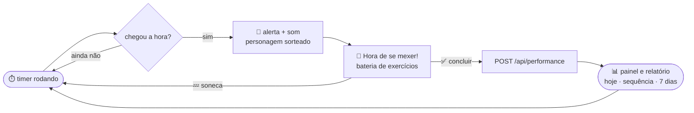
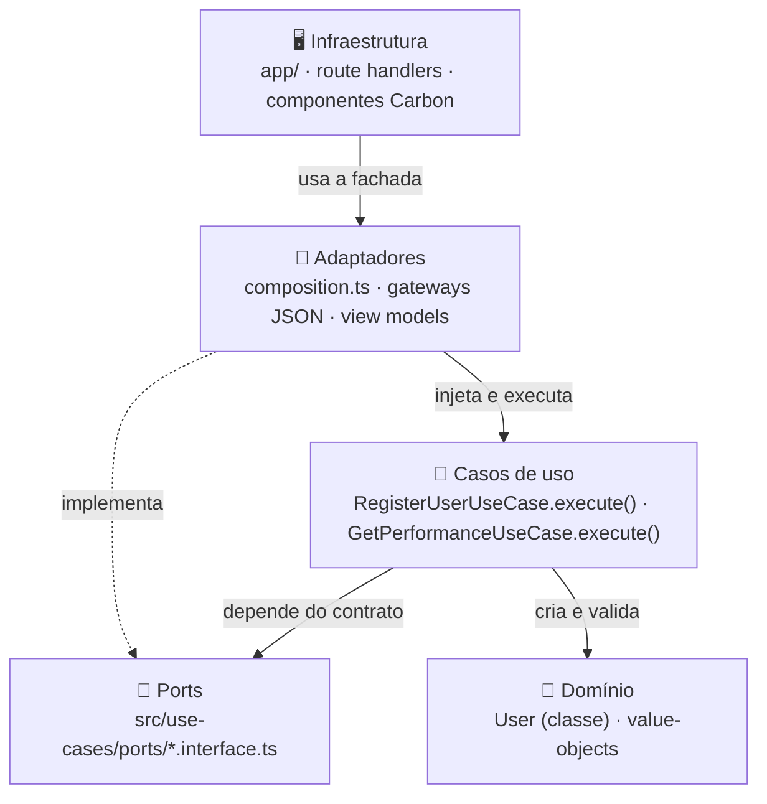
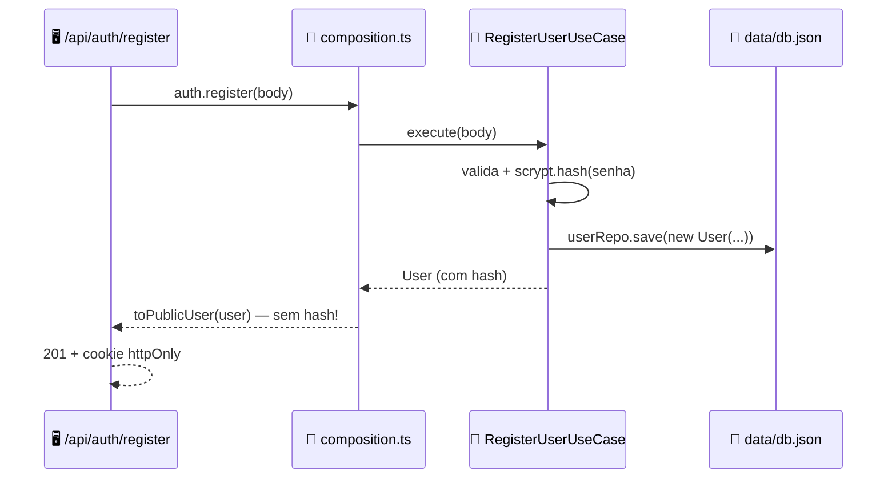

<div align="center">

# 🧍 Movimento

**Pausas que fazem bem.**

O app que tira você da cadeira — com um lembrete amigável, uma bateria de exercícios e **zero culpa**.

[](#)
[](#)
[](#)
[](#)
[](#)
[](#)

```text
        ┌─────────────────────────────────────────────────┐
        │  ⏱️   próxima pausa em 00:42:13                 │
        │                                                 │
        │  🧢   "Recruta, atenção! Chegou a hora de        │
        │        sair da cadeira."                        │
        │                                                 │
        │  🏋️   agachamentos 10 · flexões 10 ·            │
        │        panturrilhas 15 · mobilidade 10          │
        │                                                 │
        │  ▓▓▓▓▓▓▓▓▓▓░░░░░░░░░░░░░░░░░░░░░░  2 / 6        │
        │  baterias concluídas hoje                       │
        │                                                 │
        │  [ ▶ Iniciar ]      [ 💤 Soneca 5 min ]         │
        └─────────────────────────────────────────────────┘
```

</div>

## 🤔 O que é isso?

**Movimento** é um PWA (instalável no celular ou no desktop) que transforma as pausas do dia em **pequenas sessões de movimento**. Você escolhe o intervalo; quando o timer fecha, um dos três personagens aparece para chamar você — com som, mensagem e uma bateria de exercícios que dá pra fazer ao lado da mesa.

| Recurso | O que faz |
| --- | --- |
| ⏱️ **Timer configurável** | 60 minutos por padrão, com **soneca** de 5 minutos e o horário da próxima pausa visível |
| 🎭 **Personagem sorteado** | A cada pausa, uma das três vozes assume o comando (ou você fixa uma, se preferir) |
| 🏋️ **Bateria editável** | Agachamentos (10), flexões (10), panturrilhas (15) e mobilidade (10 movimentos) — dá para adicionar, editar e remover |
| 🔔 **Aviso sonoro + notificação** | Bipe gerado na hora (Web Audio) e notificação do navegador quando você permite |
| 📊 **Relatório de movimento** | Movimentos de hoje, hora do último movimento, sequência de dias e gráfico dos últimos 7 dias |
| 🎯 **Meta diária** | 6 baterias por dia, com barra de progresso no painel |
| 🔐 **Conta com login** | Senha com hash `scrypt` e sessão em cookie `httpOnly` |
| 🌗 **Tema claro/escuro** | Toggle no cabeçalho, tudo em Carbon Design System |
| 📴 **Funciona offline** | Service worker com app shell em cache + página de fallback |
| ♿ **Acessível** | Foco de teclado, `aria-label` nos ícones, contraste por tokens Carbon |

## 🎭 Os três personagens

```text
     🧢                        👩‍⚕️                        🧘
 Capitão Augusto              Dra. Lia              Mestre Bento
 coragem e movimento      ciência e cuidado     presença e equilíbrio
```

| Personagem | Voz | Exemplo de chamado |
| --- | --- | --- |
| 🧢 **Capitão Augusto** | Firme, calorosa, espírito de equipe | *"Comandante, nenhuma grande mudança começa sem o primeiro passo."* |
| 👩‍⚕️ **Dra. Lia** | Clara, didática, sem alarmismo | *"Uma pausa curta ajuda a quebrar longos períodos sentado."* |
| 🧘 **Mestre Bento** | Serena, gentil, anti-perfeccionismo | *"A constância nasce de pequenos gestos. Comece do ponto em que está."* |

> 📌 **Regra de produto:** a rotina **nunca** oferece um seletor de personagem. A cada novo início do ciclo, um personagem é sorteado — a mensagem chega como surpresa, não como escolha.

## 🔄 O ciclo de uma pausa



Cada "concluir" grava um movimento no servidor (`data/db.json`) e devolve as métricas atualizadas para o painel. Por isso o contador do dia sobrevive a um F5, a outro navegador e ao celular — não é só estado de tela.

## 🚀 Rodando aí na sua máquina

**Requisitos:** Node.js **≥ 20.9** e npm.

```bash
npm install

npm run dev        # desenvolvimento em http://localhost:3000
npm run build      # build de produção
npm start          # serve o build em http://localhost:3000
```

| Script | Faz o quê |
| --- | --- |
| `npm run dev` | `next dev --webpack` — servidor de desenvolvimento |
| `npm run build` | `next build --webpack` — build otimizado |
| `npm start` | `next start` — serve o build (é só aqui que o service worker entra em ação) |
| `npm run dev:turbo` / `npm run build:turbo` | o mesmo com Turbopack (**hoje falha no Windows** — veja abaixo) |
| `npm run check:pwa` | roda `scripts/check-pwa.ps1` contra `http://localhost:3000` e valida toda a superfície PWA |
| `npm run icons` | regenera os PNG/ICO a partir de `app/icon.svg` |

> 🪟 **Nota de Windows:** `dev` e `build` usam **webpack** de propósito. O Turbopack não resolve os `@use`/`@forward` relativos do Sass dentro de `node_modules` no Windows, e o Carbon tem importações exatamente assim (`scss/config`, `scss/generated/tokens`) — o build inteiro para com *"Can't find stylesheet to import"*. O diagnóstico completo, com links das issues do Next.js, está em [`docs/BUILD_NOTES.md`](docs/BUILD_NOTES.md). Os scripts `*:turbo` ficam no `package.json` para o dia em que o upstream corrigir.

> 📱 **Testar no celular:** rode `npm run dev` e abra o IP da máquina na LAN (ex.: `http://192.168.0.10:3000`). O cookie de sessão segue o protocolo do pedido: em `http://` ele **não** é `secure`, senão o navegador descartaria o login.

### Deploy no Vercel + banco de dados

O deploy e o Next padrao (`next build --webpack`), mas atencao: no Vercel o disco e **somente leitura** - em producao os dados moram no **Upstash for Redis** (chave `movimento:db`, mesmo formato JSON do `data/db.json` local).

Para ligar o banco: **Storage -> Marketplace -> Upstash for Redis** -> conecte ao projeto -> **Redeploy**. Pronto: `register -> login -> performance` passam a persistir.

> Guia completo (passo a passo, como o codigo escolhe o store, Redis local e problemas comuns) em **[docs/DATABASE.md](docs/DATABASE.md)**.


## 🗺️ Mapa do repositório

```text
app/                          # rotas do Next.js (App Router) + fronteira HTTP
├── page.tsx                  # abre o painel
├── login/ register/ dashboard/
└── api/                      # route handlers
    ├── auth/register | login | logout | me
    └── performance

src/                          # as quatro camadas vivem aqui
├── domain/                   # 💎 entidades e regras de negócio puras
├── use-cases/                # 🧠 regras da aplicação + ports/*.interface.ts
├── adapters/                 # 🔌 gateways JSON, composition.ts e view models
└── infrastructure/           # 🖥️ componentes Carbon e helpers HTTP

components/                   # UI do app (starter legado): movimento-app, tema, cabeçalho
public/                       # sw.js, offline.html, avatares e ícones da PWA
data/db.json                  # store de dev (no Vercel os dados ficam no Upstash Redis)
docs/                         # PWA, build, style guide e especificações do produto
scripts/                      # check-pwa.ps1 e geração dos ícones
```

## 🏛️ Arquitetura: quatro camadas, uma regra

O projeto segue Clean Architecture de verdade: **as dependências apontam só para dentro**. Nada de `fetch` dentro de regra de negócio, nada de `@carbon/react` dentro do domínio.



Três exemplos dessa fronteira no dia a dia:

- o **caso de uso não sabe onde o dado mora**: ele conversa com `IUserRepository`; quem abre o arquivo é o `JsonUserRepository`;
- o **domínio não vaza segredo**: a entidade `User` carrega o `passwordHash`, mas `toPublicUser()` corta esse campo antes de qualquer coisa sair do servidor;
- os **componentes Carbon são burros de propósito**: quem calcula é o caso de uso / view model; o componente só desenha.

> 📚 As regras completas (com templates de código por camada) estão no [`.clinerules`](.clinerules) — é o documento que os agentes de IA deste repositório seguem.

### 🔐 Como o cadastro funciona, por dentro



A senha nunca é guardada em texto puro (scrypt com salt), o token de sessão só vive no cookie `httpOnly` e em disco fica apenas o `sha256` dele. A senha exige 8+ caracteres, com pelo menos uma letra e um número — e o login sempre devolve a mesma mensagem ("E-mail ou senha incorretos"), para não contar a estranhos qual campo falhou.

## 🔌 API

| Método | Rota | O que faz | Status |
| --- | --- | --- | --- |
| `POST` | `/api/auth/register` | cria a conta e já abre a sessão | `201`, `400` (validação), `409` (e-mail já cadastrado) |
| `POST` | `/api/auth/login` | autentica e abre a sessão | `200`, `401` |
| `POST` | `/api/auth/logout` | destrói a sessão e limpa o cookie | `200` |
| `GET` | `/api/auth/me` | devolve o usuário da sessão | `200`, `401` |
| `GET` | `/api/performance` | métricas de desempenho | `200`, `401` |
| `POST` | `/api/performance` | registra um movimento concluído | `201`, `401` |

O formato das métricas:

```jsonc
{
  "todayCount": 2,         // movimentos registrados hoje
  "lastMovement": "14:32", // hora do último movimento (ou null)
  "goal": 6,               // meta diária de baterias
  "streakDays": 3,         // dias seguidos com pelo menos um movimento
  "totalMovements": 128,   // total histórico
  "week": [{ "date": "2026-09-30", "count": 2 }]  // últimos 7 dias
}
```

## 📲 PWA: instale, use offline — e o fantasma do Vite

O app é instalável ("Adicionar à tela de início") e publica cada peça pela convenção do Next:

| URL | Quem serve |
| --- | --- |
| `/manifest.webmanifest` | `app/manifest.ts` — `display: standalone`, ícone maskable e atalho "Próximo movimento" |
| `/icon.svg`, `/favicon.ico`, `/apple-icon.png` | convenções de metadata do Next, em `app/` |
| `/icons/icon-192.png`, `/icons/icon-512.png`, `/icons/maskable-512.png` | `public/icons/` (gerados por `npm run icons`) |
| `/sw.js` | service worker em JS puro — URL fixa, sem bundling |
| `/offline.html` | página de fallback quando não há rede |

> 👻 **Curiosidade:** este domínio já rodou uma PWA em Vite, e alguns navegadores ainda guardavam aquele service worker antigo, que respondia com um shell cheio de 404 (`/@vite/client`, `/src/main.tsx`…). Por isso o registro do service worker (`components/service-worker-registrar.tsx`) **desregistra workers que não sejam o nosso**, apaga caches que não começam com `movimento-` e recarrega a página uma única vez. A história completa e o procedimento de recuperação manual estão em [`docs/PWA.md`](docs/PWA.md). Existe até um redirect permanente de `/favicon.svg` (URL do Vite) para `/icon.svg`.

**Validando a PWA de ponta a ponta:**

```bash
npm run build
npm start            # em outro terminal
npm run check:pwa    # exit 0 = manifest, ícones, metas, service worker e offline OK
```

## ✅ Qualidade e verificação

Não há framework de testes configurado — a verificação é esta:

```bash
npx tsc --noEmit     # 0 erros de tipo
npm run build        # compila + type-check do Next
npm run check:pwa    # contrato da PWA contra o servidor de produção
```

E, em mudanças de fluxo HTTP, um **smoke test das rotas** na mão: `register` → `login` → `me` → `performance` → `logout`, conferindo os status (`201`, `200`, `401`, `409`) e que **nenhuma resposta devolve `passwordHash`**.

## 📚 Documentação

| Documento | Assunto |
| --- | --- |
| [`docs/PWA.md`](docs/PWA.md) | contrato da PWA, limpeza do worker legado e recuperação manual |
| [`docs/BUILD_NOTES.md`](docs/BUILD_NOTES.md) | por que o build usa webpack e o que o Turbopack quebra no Windows |
| [`docs/STYLE_GUIDE.md`](docs/STYLE_GUIDE.md) | tokens Carbon, tipografia, espaçamento e checklist de UI |
| [`docs/DATABASE.md`](docs/DATABASE.md) | banco de dados: Upstash for Redis no Vercel, `data/db.json` local, passo a passo e problemas comuns |
| [`.clinerules`](.clinerules) | Clean Architecture: camadas, proibições e templates de código |

## 🧭 Notas e cuidados

- **Persistencia:** localmente os dados ficam em `data/db.json`; no Vercel, no Upstash Redis (guia completo em [`docs/DATABASE.md`](docs/DATABASE.md)). E um documento JSON unico, pensado para uso pessoal - nao e banco para escala.
- 🗂️ **Código legado na raiz:** as pastas `components/` e `domain/` vêm do starter/migração. O `components/` ainda entrega a UI do app (`movimento-app.tsx`, tema e cabeçalho); o `domain/` da raiz não é importado por ninguém e `components/sections/*` são sobras do starter Carbon. Código novo vai para `src/`.
- 🌍 **Idioma:** a interface e os textos de produto são em **pt-BR**; no código, siga o idioma dos comentários do arquivo que estiver editando.

## ❤️ Aviso amigável

O Movimento incentiva pausas e movimento leve — ele **não substitui profissionais de saúde**. Em caso de dor, tontura, falta de ar ou mal-estar, pare e procure orientação profissional. 🙂

---

<div align="center">

**Feito para lembrar você de levantar da cadeira.** 🪑 ➜ 🧍

*"Um passo de cada vez também é avanço."* — Capitão Augusto

</div>
